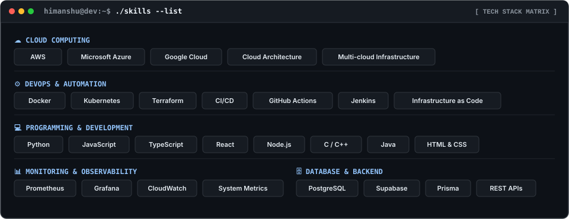

<div align="center">

<!-- ==================== MASTER TERMINAL CARD ==================== -->
<table border="0" width="100%" cellspacing="0" cellpadding="0" style="max-width: 960px; border-collapse: collapse; border: 1.5px solid #D4D4D4; border-radius: 12px; overflow: hidden; background: #FFFFFF;">
  <!-- Window Titlebar -->
  <tr>
    <td colspan="2" style="padding: 0; margin: 0; line-height: 0;">
      
    </td>
  </tr>
  <!-- Content Body: 40% Portrait / 60% Dashboard -->
  <tr>
    <td width="42.4%" valign="top" style="padding: 6px; margin: 0; border-right: 1.5px solid #E5E5E5; background: #FFFFFF;">
      <!-- Real Photo Biometric Scanning Animation -->
      
    </td>
    <td width="57.6%" valign="top" style="padding: 6px; margin: 0; background: #FFFFFF;">
      <!-- Terminal Dashboard -->
      
    </td>
  </tr>
</table>

<br />

<!-- Quick Interactive Action Links -->
<p align="center">
  <a href="https://github.com/Himanshu5619"></a>
  <a href="https://linkedin.com/in/himanshu-singh-b3aa71218"></a>
  <a href="mailto:himanshu.s19@proton.me"></a>
  <a href="https://himanshu5619.github.io/Portfolio/"></a>
  <a href="https://komarev.com/ghpvc/?username=Himanshu5619&label=PROFILE%20VIEWS&color=111111&style=for-the-badge" alt="Views" />
</p>

</div>

---

<!-- ==================== SECTION: CAT ABOUT.MD (40/60 TERMINAL CARD) ==================== -->
<div align="center">

<table border="0" width="100%" cellspacing="0" cellpadding="0" style="max-width: 960px; border-collapse: collapse; border: 1.5px solid #30363D; border-radius: 12px; overflow: hidden; background: #0D1117;">
  <!-- Terminal Window Bar -->
  <tr>
    <td colspan="2" style="background: #161B22; padding: 10px 16px; border-bottom: 1px solid #30363D;">
      <span style="color: #FF5F56;">●</span>
      <span style="color: #FFBD2E;">●</span>
      <span style="color: #27C93F;">●</span>
      &nbsp;&nbsp;<code style="background: transparent; color: #C9D1D9; border: none; font-size: 12px; font-weight: 600;">himanshu@dev:~$ cat about.md</code>
      <span align="right" style="float: right; color: #8B949E; font-size: 11px; font-family: monospace;">SYSTEM STATUS: <b style="color: #34D399;">ONLINE ●</b></span>
    </td>
  </tr>
  <tr>
    <!-- Left Column: 40% Profile Photograph with scanning animation -->
    <td width="38%" valign="top" style="padding: 14px; border-right: 1px solid #30363D; background: #0D1117; text-align: center;">
      <div style="border: 1px solid #30363D; border-radius: 8px; overflow: hidden; background: #161B22; box-shadow: 0 4px 20px rgba(0,0,0,0.4);">
        
      </div>
      <div style="margin-top: 10px; font-family: monospace; font-size: 11px; color: #8B949E; line-height: 1.6;">
        <code>TARGET: HIMANSHU SINGH</code><br/>
        <span style="color: #34D399; font-weight: bold;">● BIOMETRIC VERIFIED</span>
      </div>
    </td>
    <!-- Right Column: 60% Interactive Terminal Output -->
    <td width="62%" valign="top" style="padding: 10px; background: #0D1117;">
      
    </td>
  </tr>
</table>

</div>

<details>
<summary><b>📄 View Accessible Terminal Text (about.md)</b></summary>

```bash
# HIMANSHU SINGH // CLOUD & DEVOPS ENTHUSIAST
NAME       : Himanshu Singh
LOCATION   : India
EDUCATION  : B.Tech CSE (Cloud Computing & Virtualization Technologies)
UNIVERSITY : UPES, Dehradun
ROLE       : Cloud Computing Enthusiast • DevOps & Automation • Full-Stack Developer
FOCUS      : Cloud Infrastructure • Infrastructure as Code (IaC) • CI/CD Automation
STATUS     : Building | Learning | Exploring
MISSION    : "Build scalable, reliable and automated solutions — one commit at a time."
```
</details>

---

<!-- ==================== SECTION: SKILLS MATRIX ==================== -->
<div align="center">



</div>

---

<!-- ==================== SECTION: FEATURED PROJECTS ==================== -->
### `himanshu@dev:~$ ls -la ./projects`

<table border="0" width="100%" cellspacing="0" cellpadding="8">
  <tr>
    <td width="50%" valign="top">
      <div style="border: 1px solid #30363D; border-radius: 8px; padding: 16px; background: #161B22;">
        <h4>☁️ <a href="https://github.com/Himanshu5619/Cloud-Cost-Optimizer" style="color: #58A6FF;">Cloud-Cost-Optimizer</a></h4>
        <p style="color: #8B949E; font-size: 13px; line-height: 1.5;">Automated cloud-based solution that monitors resource utilization and helps optimize cloud expenses by identifying underutilized compute resources.</p>
        <p>
          <code>Terraform</code> <code>AWS</code> <code>Python</code> <code>IaC</code>
        </p>
        <p>🔗 <a href="https://github.com/Himanshu5619/Cloud-Cost-Optimizer" style="color: #58A6FF; font-weight: bold;">Explore Repository →</a></p>
      </div>
    </td>
    <td width="50%" valign="top">
      <div style="border: 1px solid #30363D; border-radius: 8px; padding: 16px; background: #161B22;">
        <h4>🐳 <a href="https://github.com/Himanshu5619/Docker-Container" style="color: #58A6FF;">Docker-Container Showcase</a></h4>
        <p style="color: #8B949E; font-size: 13px; line-height: 1.5;">Comprehensive repository demonstrating containerization, optimized Dockerfiles, and multi-container deployment concepts with microservices.</p>
        <p>
          <code>Docker</code> <code>Linux</code> <code>Python</code> <code>Microservices</code>
        </p>
        <p>🔗 <a href="https://github.com/Himanshu5619/Docker-Container" style="color: #58A6FF; font-weight: bold;">Explore Repository →</a></p>
      </div>
    </td>
  </tr>
  <tr>
    <td width="50%" valign="top">
      <div style="border: 1px solid #30363D; border-radius: 8px; padding: 16px; background: #161B22;">
        <h4>⚡ <a href="https://github.com/Himanshu5619/fastapi--dockerize" style="color: #58A6FF;">FastAPI Docker CI/CD</a></h4>
        <p style="color: #8B949E; font-size: 13px; line-height: 1.5;">Demonstrates continuous integration and deployment through automated container builds, testing, and deployment using GitHub Actions.</p>
        <p>
          <code>FastAPI</code> <code>Docker</code> <code>GitHub Actions</code> <code>CI/CD</code>
        </p>
        <p>🔗 <a href="https://github.com/Himanshu5619/fastapi--dockerize" style="color: #58A6FF; font-weight: bold;">Explore Repository →</a></p>
      </div>
    </td>
    <td width="50%" valign="top">
      <div style="border: 1px solid #30363D; border-radius: 8px; padding: 16px; background: #161B22;">
        <h4>📈 <a href="https://github.com/Himanshu5619/MonitoringWithPrometheusAndGrafana" style="color: #58A6FF;">Prometheus &amp; Grafana Observability</a></h4>
        <p style="color: #8B949E; font-size: 13px; line-height: 1.5;">Full-stack observability and monitoring implementation collecting real-time system metrics, performance alerts, and interactive visualization dashboards.</p>
        <p>
          <code>Prometheus</code> <code>Grafana</code> <code>DevOps</code> <code>Linux</code>
        </p>
        <p>🔗 <a href="https://github.com/Himanshu5619/MonitoringWithPrometheusAndGrafana" style="color: #58A6FF; font-weight: bold;">Explore Repository →</a></p>
      </div>
    </td>
  </tr>
</table>

---

<!-- ==================== SECTION: GITHUB ANALYTICS ==================== -->
### `himanshu@dev:~$ ./analytics --stats`

<div align="center">

<a href="https://github.com/Himanshu5619">
  
</a>

<br /><br />

<table border="0" width="100%">
  <tr>
    <td width="50%" align="center" valign="middle">
      <a href="https://github.com/Himanshu5619">
        
      </a>
    </td>
    <td width="50%" align="center" valign="middle">
      <a href="https://github.com/Himanshu5619">
        
      </a>
    </td>
  </tr>
</table>

</div>

---

<!-- ==================== SECTION: CONNECT & FOOTER ==================== -->
<div align="center">

### `himanshu@dev:~$ ./connect`

<h3>LET'S BUILD SOMETHING TOGETHER</h3>

<p>
  <a href="https://github.com/Himanshu5619"></a>
  <a href="https://linkedin.com/in/himanshu-singh-b3aa71218"></a>
  <a href="mailto:himanshu.s19@proton.me"></a>
  <a href="https://himanshu5619.github.io/Portfolio/"></a>
</p>

<p style="color: #8B949E; font-size: 13.5px; font-style: italic; font-family: 'JetBrains Mono', monospace; margin-top: 14px;">
  "Building, learning, and exploring the possibilities of technology — one commit at a time."
</p>

</div>
