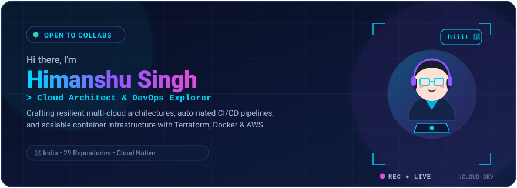
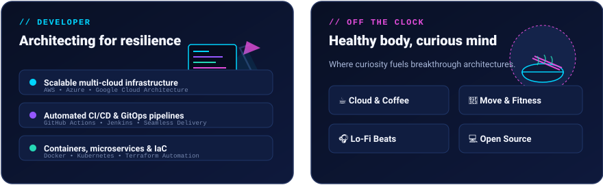
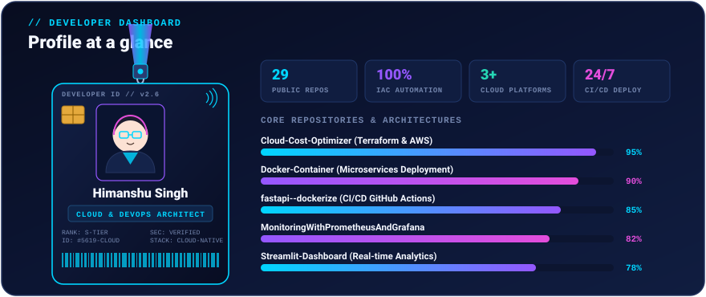
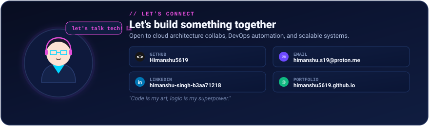

  <!-- ==================== SECTION 1: HERO ==================== -->
  

  <!-- Animated Typing Subtitle -->
   
  

 

<!-- ==================== SECTION 2: ABOUT ME & FOCUS ==================== -->

  

 

<!-- ==================== SECTION 3: TECH ORBIT & STACK ==================== -->

  

 

<!-- ==================== SECTION 4: PROFILE AT A GLANCE ==================== -->

  

 

<!-- ==================== SECTION 5: FEATURED BUILDS ==================== -->
## 💠 Featured builds

| Project | What it is | Tech Stack | Link |
| :--- | :--- | :--- | :---: |
| **☁️ Cloud-Cost-Optimizer** | Automated cloud-based architecture that monitors resource utilization and optimizes multi-cloud expenses by intelligently managing underutilized compute resources. | `Terraform` `AWS` `Python` `IaC` | [Repository](https://github.com/Himanshu5619/Cloud-Cost-Optimizer) |
| **🐳 Docker-Container** | Comprehensive repository demonstrating end-to-end containerization, from optimized multi-stage Dockerfiles to complex multi-container microservice deployments. | `Docker` `Microservices` `Linux` `Python` | [Repository](https://github.com/Himanshu5619/Docker-Container) |
| **⚡ fastapi--dockerize** | Demonstrates Continuous Delivery (CD) by automating the container build, automated testing, and deployment of a containerized FastAPI application with GitHub Actions. | `FastAPI` `GitHub Actions` `Docker` `CI/CD` | [Repository](https://github.com/Himanshu5619/fastapi--dockerize) |
| **📈 Monitoring With Prometheus &amp; Grafana** | Full-stack observability and monitoring implementation collecting real-time system metrics, performance alerts, and interactive dashboards. | `Prometheus` `Grafana` `DevOps` `Linux` | [Repository](https://github.com/Himanshu5619/MonitoringWithPrometheusAndGrafana) |
| **📊 Streamlit-Dashboard** | Interactive data analytics dashboard application providing live data visualization, metrics tracking, and exploratory data analysis. | `Python` `Streamlit` `Data Visualization` | [Repository](https://github.com/Himanshu5619/Streamlit-Dashboard) |
| **🌐 Developer Portfolio Website** | Responsive personal developer portfolio highlighting engineering projects, technical skillsets, and cloud architecture solutions. | `HTML5` `CSS3` `JavaScript` `GitHub Pages` | [Live Demo](https://himanshu5619.github.io/Portfolio/) / [Repo](https://github.com/Himanshu5619/Portfolio) |

 

<!-- ==================== SECTION 6: GITHUB ANALYTICS ==================== -->

<table border="0" width="100%">
  <tr>
    <td width="50%" align="center" valign="middle">
      
    </td>
    <td width="50%" align="center" valign="middle">
      
    </td>
  </tr>
  <tr>
    <td colspan="2" align="center">
       
      
    </td>
  </tr>
</table>

 

<!-- ==================== SECTION 7: CONNECT WITH ME ==================== -->

  

    

  <!-- Interactive Badges Row (matching reference) -->
  
  
  
  
  
  

    

  <!-- Profile Views Counter -->
  

    
  
<em>Always learning, always building. 💜</em>

